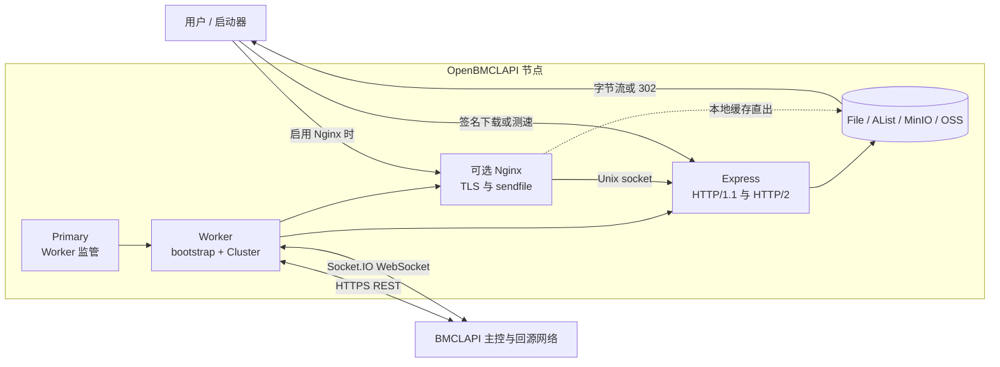

# OpenBMCLAPI 架构与重构不变量

本文档是后续重构的兼容性基线。它描述必须保持的外部协议、系统正确性和当前策略，
并明确哪些现有行为属于缺陷，不能被当作兼容目标。

## 系统边界

本仓库实现受中心主控管理的边缘缓存节点，不包含主控内部调度算法，也没有节点间协议。

- Primary 进程只监管一个 Worker，并负责退避重启。
- Worker 同时负责控制面连接、节点生命周期、文件同步、HTTP 数据面、存储适配、
  可选 Nginx 和 UPnP；其中 `ControllerClient` 已独立负责控制面 REST、认证和编解码，
  `ControllerSocket` 负责 Socket.IO 协议，`DataPlaneServer` 负责 HTTP/HTTP2 路由与监听，
  `FileSynchronizer` 负责缺失文件同步，`Cluster` 继续负责运行时编排。
- 主控文件清单是缓存状态的事实源。
- 文件以内容 hash 标识，逻辑存储键为 `<hash 前两位>/<完整 hash>`。

## 硬兼容契约

这些契约不能在单边节点升级中改变。任何变更都需要主控能力协商或双协议过渡。

### 控制面认证

- `GET openbmclapi-agent/challenge?clusterId=...`
- challenge 使用集群密钥执行 HMAC-SHA256，并编码为十六进制。
- `POST openbmclapi-agent/token` 的初次认证载荷为
  `{clusterId, challenge, signature}`。
- token 刷新载荷为 `{clusterId, token}`，响应继续提供 `{token, ttl}`。
- User-Agent 保持 `openbmclapi-cluster/<version>`。

### 控制面 REST

- `GET openbmclapi/files` 接受可选 `lastModified`；204 表示没有增量。
- 文件清单继续使用 Zstd 压缩的 Avro 数组，字段为 `path/hash/size/mtime`。
- `GET openbmclapi/configuration` 至少提供 `sync.source` 和
  `sync.concurrency`。
- `GET openbmclapi/download/:hash?noopen=1` 用于按需回源。
- `POST openbmclapi/report` 保持 `{urls, error}` 载荷。

### Socket.IO

- transport 保持 WebSocket，连接认证载荷保持 `{token}`。
- `request-cert` 返回 `[error, {cert, key}]`。
- `port-check` 与 `enable` 的载荷保持
  `{host, port, version, byoc, noFastEnable, flavor}`。
- `enable`、`disable` 的成功 ACK 必须严格为 `true`。
- `keep-alive` 载荷保持 `{time, hits, bytes}`。
- 服务端事件 `message`、`exception`、`warden-error` 保持可处理。

### HTTP 数据面

- `/download/:hash` 使用查询参数 `s` 和 `e` 校验签名及有效期。
- 无效签名返回 403；不存在的回源对象保持 404 语义。
- 成功响应保留 `x-bmclapi-hash`，并继续支持 Range 和可选附件名。
- `/measure/:size` 使用相同签名机制，范围为 0 到 200 MiB，实际响应长度必须
  等于 `Content-Length`。
- Nginx 的内部 `/auth` 子请求继续使用 `X-Original-URI`，成功返回 204。

### 配置面

已公开环境变量的名称、必填性、默认值和语义必须保持兼容，包括集群凭据、监听及
公开端口、BYOC、证书、Nginx、UPnP、主控地址和存储配置。

## 正确性不变量

### 文件完整性

1. 相同 hash 在所有存储后端必须表示相同字节。
2. 32 字符摘要使用 MD5 校验，其他摘要使用 SHA-1 校验。
3. 文件只有在大小和摘要均匹配后才能对外可见。
4. 零字节文件是合法对象。
5. 失败或进程终止不能留下会被 `exists()` 视为成功的部分文件。

### 缓存一致性

1. 完整主控清单是唯一权威保留集合。
2. 增量清单只能更新当前状态，不能替代完整状态或直接驱动 GC。
3. 成功写入后必须立即可读；删除后所有正向缓存和内存索引必须失效。
4. 同一 hash 同时最多有一个回源下载；并发请求共享成功或失败结果。
5. GC 不得删除权威清单内、正在下载或正在服务的对象。
6. GC 必须幂等，回收计数必须反映实际删除的对象和字节。

### 节点注册

1. `enable` 只能发生在监听成功、端口巡检成功、存储可写且初始同步成功之后。
2. 任意时刻最多有一个注册或重注册操作。
3. 断线后节点立即进入未启用状态。
4. 只有先前期望在线的节点才允许自动重新注册。
5. Worker 只能在 `enable` ACK 成功后向 Primary 发送 `ready`。
6. 优雅停止时，先停止心跳和接收新工作，再完成 `disable`，最后关闭连接和服务。

### 流量与带宽信号

1. 心跳继续上报 `{time, hits, bytes}`。
2. 只有 ACK 成功后才能扣除对应计数快照。
3. ACK 等待期间产生的新计数必须保留，不能丢失或重复上报。
4. File、AList、MinIO、OSS 对同一下载和 Range 请求必须产生等价计量语义。
5. 本仓库没有全局带宽调度器；必须保持的是测速结果、心跳计量和同步并发信号。

Storage V2 将 `bytes` 明确定义为成功请求逻辑交付的对象载荷字节数：完整 GET 为文件
大小，有效 Range 为合并区间长度之和，HEAD 和不可满足 Range 为 0，语法无效且被
服务端忽略的 Range 按完整文件计算。对于对象存储重定向，这是节点完成下载交接时可
可靠获得的计量值，不代表客户端最终实际接收的 TCP 字节数。

## 行为保持阶段的策略快照

- 同步并发使用主控下发的 `sync.concurrency`。
- Got 的文件下载内建重试关闭，由 `pRetry` 提供最多 10 次额外重试。
- 摘要校验失败也进入文件重试。
- 一轮同步会继续处理其他文件，但任一文件最终失败会使整轮同步失败。
- 心跳周期为 1 分钟，单次等待 10 秒，连续 3 次失败后软重连。
- 软重连总预算为 10 分钟，失败后退出 Worker。
- Worker 退避因子为 2、抖动为正负 20%、名义上限为 60 秒；
  收到 `ready` 后重置。
- Primary 等待 Worker 退出的上限为 30 秒。

这些数值是无行为重构阶段的冻结策略，不是永久协议。后续调整必须有故障注入测试和
独立发布说明。

## 已知违反不变量的行为

当前没有仍未修复且已确认的正确性不变量违反；新增发现应先记录在本节，再进入修复。

## 本阶段已修复

1. 增量刷新现在同步主控返回的增量清单，不再重复同步启动时的完整清单。
2. MinIO 对象键统一使用 POSIX 分隔符；GC 按相对路径 basename 与 hash 比较，
   并正确更新删除字节数、内存索引和存在性缓存。
3. 按需下载现在先验证摘要再进入存储；本地缓存通过同目录临时文件和原子重命名
   发布，不再暴露部分文件。
4. token 初次获取和刷新均为单飞操作；刷新失败会重新调度，停机时会取消计时器。
5. 节点注册使用显式 `disabled/enabling/enabled/disabling` 状态机串行化转换；断线会
   淘汰进行中的旧注册结果，只有期望在线的节点才会重新注册。
6. Storage V2 使用规范化下载请求统一 File、AList、MinIO 和 OSS 的 Range、附件名、
   上游响应头与 `bytes/hits` 计量；OSS 代理现在会向对象存储转发 Range。
7. Worker 使用根 `AbortController` 统一取消控制面请求、文件同步、重试等待、按需回源、
   对象存储流、后台 GC、清单刷新和 UPnP 续期；停机等待已登记后台任务收敛后返回。
8. 控制面 REST 已提取为 `ControllerClient`，集中管理 URL、Bearer Token、超时、缓存、
   文件清单 Zstd/Avro 解码、配置校验、下载进度和错误上报；`Cluster` 只保留委托入口。
9. Socket.IO 连接、WebSocket transport、认证、重连事件和 ACK 编解码已提取为
   `ControllerSocket`；节点状态决策、服务退出和计量扣减仍由原生命周期组件负责。
10. HTTP/HTTP2 路由、签名检查、按需回源单飞、存储响应、计量、监听和关闭已提取为
    `DataPlaneServer`；Nginx 仍作为独立的可选前置进程保留原行为。
11. 缺失文件检查、并发下载、十次重试、摘要校验、进度条、重定向错误上报和失败汇总已
    提取为 `FileSynchronizer`；同时适配 `p-retry` v8 的 `{error}` 回调结构，恢复失败上报。

## 迁移顺序

1. 建立假主控、Socket ACK、清单编解码、存储一致性和可控时钟测试。
2. 已完成增量同步和 MinIO GC 的代码修复及纯函数回归测试；真实 MinIO 环境仍需
   dry-run 验证后再启用删除。
3. 已从 `Cluster` 提取显式节点状态机、控制面 REST 客户端、Socket.IO 协议客户端和
   HTTP 数据面服务及文件同步器且未改变协议；下一步拆分 Nginx 进程管理。
4. 已引入支持原子写入、统一 Range、附件名和计量语义的 Storage V2。
5. token 刷新恢复、ACK 等待取消和全局停机取消已完成；继续完善背压和子进程恢复。
6. 使用影子比较、单节点 canary、隔离删除和能力协商渐进发布。

## 运行时与依赖升级规则

- Node.js 同时覆盖当前 LTS 和最新 Current 版本。
- CI、Docker 镜像、`engines` 和 TypeScript 基础配置必须表达相同支持范围。
- `package-lock.json` 是唯一提交的依赖锁文件，CI、发布和 Docker 继续使用
  `npm install`。
- Bun 是本地开发推荐的依赖安装器和脚本调度器；服务进程仍由 Node.js 运行。
- `@mongodb-js/zstd` 的原生安装脚本必须保持在 npm `allowScripts` 和 Bun
  `trustedDependencies` 白名单中；升级该依赖时要同步审查并更新版本钉扎。
- 生产依赖升级到最新稳定版本。
- 工具链使用能共同满足 peer dependency 的最新组合；不能为了版本号使用
  `--force` 或 `--legacy-peer-deps`。
- 每组 major 升级必须通过全新 `npm install`、lint、build 和协议回归测试。
- 依赖升级阶段不改变上述业务协议及正确性语义。
